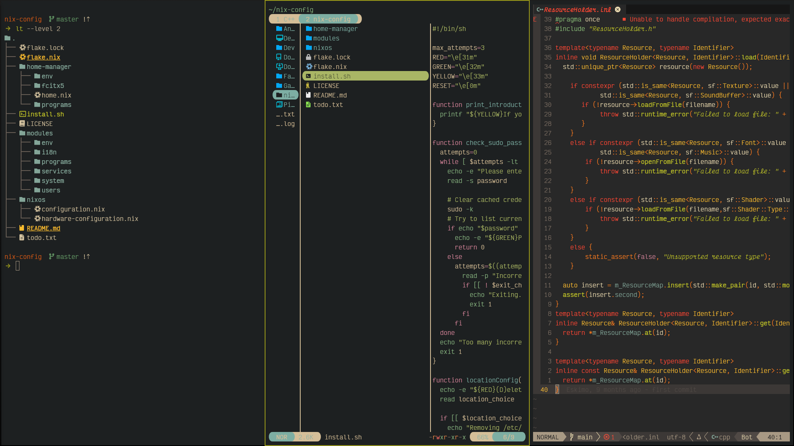

<div align="center">
  <h1>:snowflake: NixOS configuration :snowflake:</h1>
</div>

<p align="center">
  <a href="https://nixos.org"></a>
  <a href="https://github.com/mightyiam/dendritic"> </a>
  <a href="https://flake.parts/"></a>
</p>

## Design
* Config was made using [github:vic/den][den] configuration tool with [SoC][SoC] in mind
* Code is documented with tips I learned along the way and should assist with user comprehension

## Goals
* This config's main focus is **[TUI][TUI] experience** improvement via various tweaks, plugins, integrations etc. to elevate everyday terminal tasks.
  Most of the software comprising this config are aiming to assist this goal.
* The config aims to be **keyboard-driven** wherever I found so to be fitting.
* All choices are usually made with regard to **elegance** and **privacy** as well.
* **[Neovim][neovim]** is pushed to the edges and is meant to be used as an **all-encompassing text editor**. Currently it is equiped with capabilities for my workflow ([C++][C++] mostly) but will likely be extended in the future.
* **Fallback GUI software** is present for some inescapable situations.
* **Uniformness** prefered, therefore config is made to employ widely-supported **[gruvbox][gruvbox] theme** for most of the software.
* **Light gaming** software packed as well, I use it primarily for [VNs][VN]

## Included

<div align="center">

  |  Functionality |   Software                                                                                                |
  |:--------------:|:---------------------------------------------------------------------------------------------------------:|
  | Shell          | [fish][fish]                                                                                              |
  | Terminal       | [kitty][kitty]                                                                                            | 
  | File Editor    | [neovim][neovim] via [nixvim][nixvim]                                                                     |
  | File Manager   | [yazi][yazi], with [thunar][thunar] as fallback                                                           |
  | Compositor     | [wayland][wayland]                                                                                        |
  | Window Manager | [niri][niri]                                                                                              |
  | Quickshell     | [noctalia][noctalia], with [dms][dms] as another option                                                   |
  | Browser        | [zen-browser][zen-browser]                                                                                |
  | Input Method   | [fcitx5][fcitx5]                                                                                          |
  | Display Manager| [ly][ly]                                                                                                  |
  | Boot Loader    | [limine][limine], for setup check out [limine's README](./modules/nixos/system/hardware/limine/limine.nix)|
  | Document Viewer| [okular][okular]                                                                                          |

</div>

and many other smaller, however equally significant ones...

## Screenshoots




## Build steps
You may clone the repo with the following command:
```
nix-shell -p git --run "git clone https://codeberg.org/abyssal-twilight/nix-config.git" && cd nix-config
```
This is preferably done within user's `home` folder(`~`), but anything is fine.  
Users can be created by making a folder in [`users`]('./modules/users/') directory and adding an entry to [`hosts.nix`]('./modules/flake/hosts.nix')  
My current user is provided as an example.

## Inspirations
* https://nixos-and-flakes.thiscute.world (the cornerstone of my journey)
* https://codeberg.org/Moortu/dotfiles (dendritic design with den)
* https://github.com/AniviaFlome/nix-config ([fish][fish] and [zen-browser][zen-browser]))
* https://github.com/zerokqx/ZNix (some [nixvim][nixvim] plugins)

## Caveats
<details>
  <summary><a href="https://gihub.com/0xc000022070/zen-browser-flake">zen-browser-flake</a></summary>  
  Only setting `*` as the profile name seems to yield expected results for containers and workspaces, 
  so I have resorted to that instead of `$username`. I cannot assert why at the moment.
</details>

<details>
  <summary><a href="https://fcitx-im.org/wiki/Fcitx_5">fcitx5</a></summary>
  I set up the `GTK_IM_MODULE` environment variable despite warnings since that seems to be  
  the only way for fcitx5 to work within <a href=https://noctalia.dev>noctalia</a>.  
  Details 
  <a href=https://fcitx-im.org/wiki/Using_Fcitx_5_on_Wayland#TL;DR_Do_we_still_need_XMODIFIERS
    ,_GTK_IM_MODULE_and_QT_IM_MODULE?>here</a>.
</details>

[fish]: https://fishshell.com
[kitty]: https://sw.kovidgoyal.net/kitty
[neovim]: https://neovim.io
[nixvim]: https://github.com/nix-community/nixvim
[yazi]: https://yazi-rs.github.io
[wayland]: https://wayland.freedesktop.org
[niri]: https://niri-wm.github.io/niri
[noctalia]: https://noctalia.dev
[zen-browser]: https://github.com/0xc000022070/zen-browser-flake 
[fcitx5]: https://fcitx-im.org/wiki/Fcitx_5
[ly]: https://codeberg.org/fairyglade/ly
[limine]: https://codeberg.org/Limine/Limine
[okular]: https://okular.kde.org

[den]: https://den.oeiuwq.com
[SoC]: https://en.wikipedia.org/wiki/Separation_of_concerns
[TUI]: https://en.wikipedia.org/wiki/Text-based_user_interface
[C++]: https://en.wikipedia.org/wiki/C%2B%2B
[gruvbox]: https://duckduckgo.com/?q=gruvbox&iar=images&t=ffab
[VN]: https://en.wikipedia.org/wiki/Visual_novel
