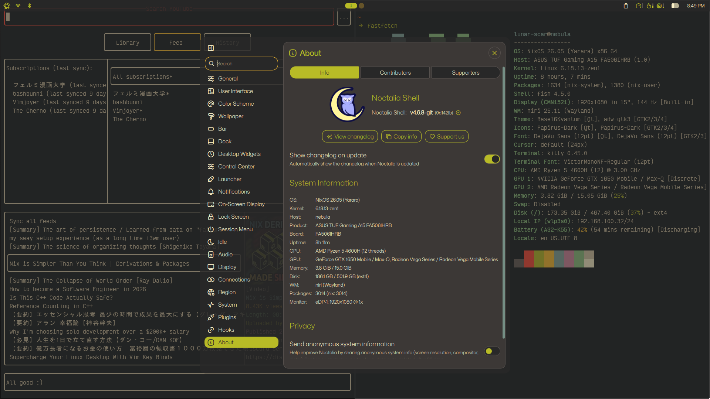
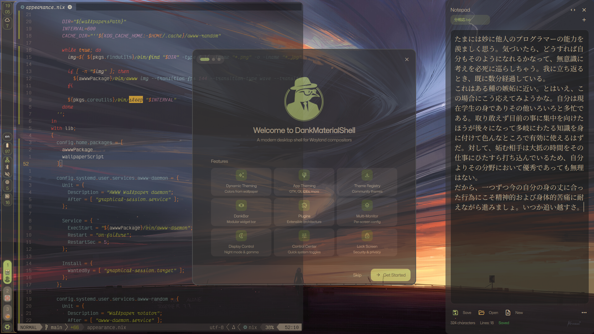

# NixOS configuration

<a href="https://nixos.org"></a>
<a href="https://den.denful.dev"> </a>


## Credits
* https://nixos-and-flakes.thiscute.world (the cornerstone of my journey)
* https://den.denful.dev/tutorials/default (base)
* https://github.com/AniviaFlome/nix-config ([fish][fish] and [zen-browser][zen-browser])
* https://github.com/zerokqx/ZNix (some [nixvim][nixvim] plugins)

## Design
* [denful/den][den] framework with [SoC][SoC] in mind.
* Code is documented with tips I learned along the way.

## Goals
* [TUI][TUI] experience
* Keyboard-driven
* [Neovim][neovim] as an **all-encompassing text editor**
* Uniformness with **[gruvbox][gruvbox]** theme
* **Light gaming** , I use it primarily for [VNs][VN]

## Included

<div align="center">

  |  Functionality   |   Software                                                            |
  |:----------------:|:---------------------------------------------------------------------:|
  | Terminal         | [kitty][kitty]                                                        |
  | File Editor      | [neovim][neovim](native and [nixvim][nixvim])                         |
  | File Manager     | [yazi][yazi] / [thunar][thunar]                                       |
  | Window Manager   | [niri][niri]                                                          |
  | Quickshell       | [noctalia][noctalia], with [dms][dms] as another option               |
  | Browser          | [zen-browser][zen-browser]                                            |
  | Document Viewer  | [zathura][zathura]                                                    |
  | Input Method     | [fcitx5][fcitx5]                                                      |
  | Wallpaper Manager| [awww][awww]                                                          |
  | Shell            | [fish][fish]                                                          |
  | Display Manager  | [ly][ly]                                                              |
  | Boot Loader      | [limine][limine], for setup check [README](./modules/aspects/hardware)|
  | Memory layout    | btrfs (unencrypted) via [disko][disko] + [impermanence][impermanence] |

and some secondary options.

</div>

## Screenshots

### Noctalia


Logo is from https://gitlab.com/ntgn/ascii-art, licenced under [Creative Commons Attribution 4.0 International](https://gitlab.com/ntgn/ascii-art/-/blob/main/LICENSE)

### Dank Material Shell


All screenshots can be found [here](assets/screenshots).<br>
Wallpapers can be found [here](https://codeberg.org/voidptrx/wallpapers).

## Binary cache
Build artifacts are cached and stored via [cachix][cachix] at [my cache][cache].<br>
Public key is available there:
```
amanako.cachix.org-1:sYWzosQAXLkVVLsWjl/36EJy5UqYHyvs5ztnKX2mmmY=.
```
Relevant workflow file can be found [here](.github/workflows/build-and-push-to-cache.yml).

It is using amazing [omnix][omnix] to create a om.json file with all flake outputs,
which is then consumed by [cachix-push][cachix-push] tool and pushed to cache.
This way outputs are also pinned and easier to maintain.<br>
To avoid duplication and reduce cache size, store paths already present at upstream caches are avoided.

## Build steps
You may clone the repo with the following command:
```
nix-shell -p git --run "https://codeberg.org/abyssal-twilight/nix-config.git" && cd nix-config
```
This is preferably done in user's `home` folder.

Users can be created by making a folder in [`users`](modules/users) directory and adding an entry to [`hosts.nix`](modules/den/hosts.nix).<br>
My current user is provided as an example.

[kitty]: https://sw.kovidgoyal.net/kitty
[neovim]: https://neovim.io
[nixvim]: https://github.com/nix-community/nixvim
[yazi]: https://yazi-rs.github.io
[thunar]: https://docs.xfce.org/xfce/thunar/start
[niri]: https://niri-wm.github.io/niri
[noctalia]: https://noctalia.dev
[dms]: https://danklinux.com/
[zen-browser]: https://github.com/0xc000022070/zen-browser-flake
[zathura]: https://pwmt.org/projects/zathura
[fcitx5]: https://fcitx-im.org/wiki/Fcitx_5
[awww]: https://codeberg.org/LGFae/awww
[fish]: https://fishshell.com
[ly]: https://codeberg.org/fairyglade/ly
[limine]: https://codeberg.org/Limine/Limine
[disko]: https://github.com/nix-community/disko
[impermanence]: https://github.com/nix-community/impermanence

[den]: https://den.denful.dev
[SoC]: https://en.wikipedia.org/wiki/Separation_of_concerns
[TUI]: https://en.wikipedia.org/wiki/Text-based_user_interface
[C++]: https://en.wikipedia.org/wiki/C%2B%2B
[gruvbox]: https://duckduckgo.com/?q=gruvbox&iar=images&t=ffab
[VN]: https://en.wikipedia.org/wiki/Visual_novel

[cachix]: https://www.cachix.org
[cache]: https://app.cachix.org/cache/amanako
[omnix]: https://github.com/juspay/omnix
[cachix-push]: https://github.com/juspay/cachix-push
